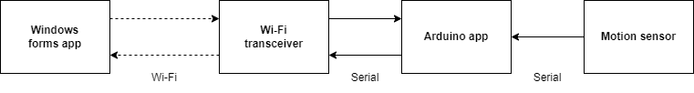
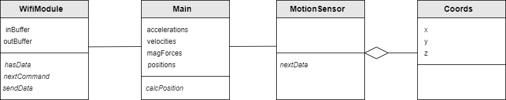
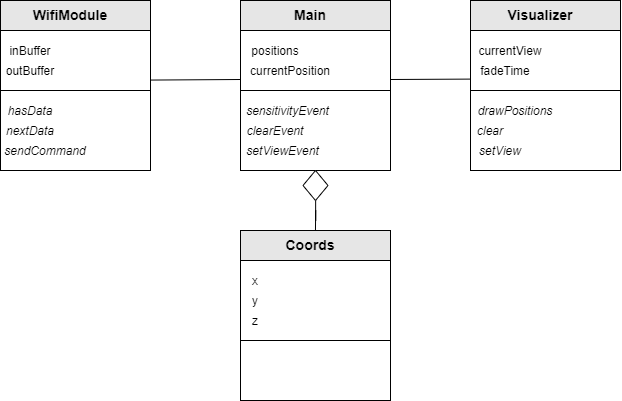
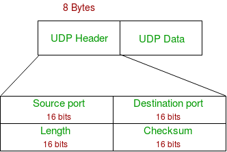

# SDD Beweging Visualisatie App

Beweging visualisatie

Lesley Wagner - 4025652

# Beschrijving

Het programma laat de bewegingen van een Arduino zien op het computerscherm. Op zichzelf heeft het programma geen nuttig doel, maar er zijn applicaties waarbij het visualiseren van bewegingen belangrijk is. De input van de gebruiker is het bewegen van de Arduino met de hand. De output is de gevisualiseerde beweging op het scherm door middel van veranderingen van kleur en kleurintensiteit. Het programma geeft de bewegingen in 3D weer. De gebruiker kan instellingen aanpassen aan de Arduino, bijvoorbeeld de sensitiviteit van de bewegingen.

# Componenten

- ESP8266
- MPU9250 9-DOF sensor
- Batterij
- Batterij oplader
- Laptop met Windows 11

# Architectuur

Hieronder is een flow diagram weergegeven voor het systeem. Een Arduino berekent zijn positie in de ruimte door middel van informatie van de bewegingssensor. De sensor verkrijgt de acceleratie in drie richtingen, de hoeksnelheid in drie richtingen en de magnetische kracht in drie richtingen. De Arduino berekent de huidige positie van zichzelf met behulp van deze data elke periode van ? milliseconden. Hij stuurt de laatst bekende posities naar de Windows computer met behulp van de Wi-Fi transceiver. De Windows computer geeft de positie en oriëntatie van de Arduino weer met een F1 3D model. Een andere knop reset het scherm. Er is een optie om de sensitiviteit van de bewegingen van de Arduino aan te passen. Deze aanpassingen wordt verstuurd naar de Arduino met Wi-Fi via de omgekeerde weg t.o.v. de positiedata.

_Figuur 1: Flow diagram_

_Figuur 2: Class diagram Arduino app_

_Figuur 3: Class diagram Windows app_

# Communicatie protocol

Er zijn twee communicatiekanalen die moeten worden ontworpen. De communicatie van de Arduino met de laptop en de communicatie van de Arduino met de bewegingssensor.

### Communicatie Arduino-Bewegingssensor

Communicatie van de Arduino met de bewegingssensor gebeurt via I2C. Dit is een seriële data protocol, met twee lijnen: SDA en SCL. SDA wordt gebruikt om data te versturen of te ontvangen. SCL draagt een kloksignaal over. Het is een synchroon protocol, dus de bits op de datalijn zijn gesynchroniseerd met het kloksignaal.

[https://www.circuitbasics.com/basics-of-the-i2c-communication-protocol/](https://www.circuitbasics.com/basics-of-the-i2c-communication-protocol/)

De I2C-communicatie wordt geïmplementeerd met de Wire library: [https://www.arduino.cc/en/reference/wire](https://www.arduino.cc/en/reference/wire)

### Communicatie Arduino-Laptop

De communicatie van de Arduino met de laptop loopt via een WiFi-signaal. Er wordt gebruik gemaakt van de internet protocol suite. De internetlaag is IPv4 en de transportlaag UDP. Voor de ontwikkeling van de software is de transportlaag UDP van het grootste belang, want de applicaties communiceren direct via UDP. UDP en de netwerklagen op lager niveau zijn geïmplementeerd met libraries en het besturingssysteem van ExpressIf en Microsoft. UDP werkt zonder individuele verbinding van apparaten en heeft geen foutcontrole. Er wordt ook geen gebruik gemaakt van handshaking. Daarom is het een lichtgewicht protocol dat geschikt is voor real-time applicaties met snelle dataoverdracht, waarbij een verlies aan informatie niet kritisch is. UDP gebruik van netwerk sockets, bestaande uit een IP adres en een poort nummer, die aangeven met welk apparaat in het netwerk moet worden gecommuniceerd. Een UDP bericht (datagram) ziet er als volgt uit:

_Figuur 4: UDP datagram_

Een datagram bestaat uit een header- en een data-deel. De header bestaat uit de poort van de zender, de poort van de ontvanger, de lengte van het pakket (header en data) en een checksum. De checksum kan optioneel worden gebruikt als foutcontrole. Om data te versturen en te ontvangen via UDP wordt gebruik gemaakt van de ESP8266WiFi library voor Arduino en de System.Net.Sockets library voor de Windows Forms app.

[https://arduino-esp8266.readthedocs.io/en/latest/esp8266wifi/udp-examples.html](https://arduino-esp8266.readthedocs.io/en/latest/esp8266wifi/udp-examples.html)

[https://docs.microsoft.com/en-us/dotnet/api/system.net.sockets.udpclient?view=net-6.0](https://docs.microsoft.com/en-us/dotnet/api/system.net.sockets.udpclient?view=net-6.0)

# Theorie oriëntatie en positie bepaling

De oriëntatie en de positie van een apparaat kunnen worden bepaald met inertiesensoren. Figuur ? laat zien hoe dat gaat. De hoeksnelheid in 3 dimensies (gemeten door een gyroscoop) wordt geïntegreerd om de rotatie de bepalen. De lineaire acceleratie in 3 dimensies (gemeten door een accelerometer) wordt eerst gecorrigeerd met de rotatie. Dan worden de componenten van de gravitatieacceleratie uit de data gehaald. Als laatste wordt de data dubbel geïntegreerd om de lineaire positie van het apparaat te bepalen. Als de sensoren perfecte metingen zouden geven, dan zou dit proces genoeg zijn om de oriëntatie en positie te bepalen. Maar metingen zijn ruizig en hebben een bias. Dit zorgt voor integratie drift. Om dat de corrigeren is het nodig om aanvullende sensoren en modellen te gebruiken.

De ESP8266 krijgt ruwe data in acceleratie, hoeksnelheid en magnetische kracht van de MPU9250 oriëntatiesensor. Om van die data de oriëntatie van de sensor te kunnen bepalen, is het nodig om te data van de drie sensors te combineren en te formatteren in een representatie van de oriëntatie met behulp van een sensor fusie algoritme. Omdat de ESP8266 relatief weinig computatie kan uitvoeren, moet het algoritme relatief eenvoudig zijn. De Madgwick oriëntatie filter wordt vaak gebruikt voor dit soort applicaties. [https://ahrs.readthedocs.io/en/latest/filters/madgwick.html](https://ahrs.readthedocs.io/en/latest/filters/madgwick.html)

## Low pass filter

De data van de sensoren bevat ruis. Ruis filters zorgen voor een meer vloeiende data signalen. De sensitiviteit van de accelerometer, de gyroscoop en de magnetometer worden afgesteld door kleine veranderingen van waarden te filteren.

## High pass filter

De acceleratie moet twee keer worden geïntegreerd om de verplaatsing te bepalen. Wanneer het signaal een DC-component bevat, dan worden te waarden door integratie onbruikbaar. Daarom is er een high pass filter voor de acceleratiesignalen, de finite impulse response (FIR) filter.

De gebruikte high pass filter is een simpele FIR filter. De filter verwijdert het gemiddelde van de laatste 5 samples van de huidige sample:

# Software ontwikkeling

De software ontwikkeling voor het systeem bestaat uit twee delen: de ESP8266 applicatie en de Windows Forms applicatie.

## ESP8266 applicatie

De ESP8266 applicatie is opgedeeld in verschillende modules, geïmplementeerd als classes.

### Setup functie

De setup functie die het volgende:

1. Configureer input en output pins.
2. Initialiseer de MPU9250.
3. Kalibreer de gyrometer en accelerometer.
4. Initialiseer de magnetometer op de MPU9250.
5. Kalibreer de magnetometer.
6. Configureer het Wi-Fi access point.
7. Luister naar inkomende verbindingen.
8. Begin UDP communicatie.
9. Wacht op bericht van de client.

### Loop functie

1. Verkrijg nieuwe sensor data.
2. Filter de sensor data met LPF.
3. Filter de acceleratie data met HPF.
4. Bereken de oriëntatie van de MPU9250.
5. Bereken de positie van de MPU9250.
6. Verstuur oriëntatie en positie data naar de client per 5 samples.
7. Verifieer elke seconde dat de client de samples binnen krijgt.
8. Als 3 keer geen bericht wordt ontvangen van de client: verbreek de verbinding, start een nieuwe UDP verbinding en wacht op antwoord van de client.

### WifiModule

De WifiModule class maakt communicatie via Wifi met de ESP8266 mogelijk door gebruik te maken van de UDP class uit de ESP8266WiFi library. Het bevat de volgende funties:

- _WiFiModule(IPAddress&amp; local\_IP, IPAddress&amp; gateway, IPAddress&amp; subnet, String&amp; hostname)__:_ De constructor configureert de ESP8266 als Wi-Fi access point.
- _bool listen()__:_ Start het Wi-Fi access point en luistert naar inkomende verbindingen. Geeft &#39;true&#39; als er een verbinding is gemaakt. Anders blijft de functie altijd doorgaan.
- _void begin(int udpPort)__:_ Start UDP communicatie op poort &#39;udpPort&#39;.
- _void close()__:_ Verbreekt de UDP communicatie.
- _bool send(Components&amp; orientation, Components&amp; position)__:_ Verzendt sensor data via UDP communicatie naar de client. Geeft &#39;true&#39; als het bericht succesvol is verstuurd, anders &#39;false&#39;.
- _bool send(Components\* orientation, Components\* position, int num\_samples)__:_ Verzendt &#39;num\_samples&#39; aantal samples van de sensor data via UDP communicatie naar de client. &#39;orientation&#39; en &#39;position&#39; zijn arrays van lengte &#39;num\_samples&#39;. Geeft &#39;true&#39; als het bericht succesvol is verstuurd, anders &#39;false&#39;.
- _bool receive():_ Ontvangt bericht van de client via UDP communicatie. Dit bericht wordt gelezen zodat het duidelijk is dat de client de data goed ontvangt. Geeft &#39;true&#39; als het bericht succesvol is ontvangen, anders &#39;false&#39;.

### MotionSensor

De MotionSensor class representeert de MPU9250 bewegingssensor. Het is een extensie van de MPU9250 class uit een externe library. Het bevat functies die de data verkrijgt en filters die de data vervormt. Sommige van de gebruikte functies komen uit de MPU9250 class; deze worden hier niet benoemd. De MPU9250 class bevat bijvoorbeeld functies voor kalibarie.

- _void updateData()__:_ Leest nieuwe data van de sensor als het beschikbaar is.
- _Components getAcc()__:_ geeft geschaalde acceleratie samples met bias weggehaald.
- _Components getVel()__:_ geeft geschaalde hoeksnelheid samples met bias weggehaald.
- _Components getAcc()__:_ geeft geschaalde magnetische kracht samples met bias weggehaald.
- _Components accLPF(Components&amp; currentAcc, Components&amp; prevAccLP)__:_ filtert ruis uit de acceleratie data, laagdoorlaatfilter.
- _Components velLPF(Components&amp; currentVel, Components&amp; prevVelLP)__:_ filtert ruis uit de hoeksnelheid data, laagdoorlaatfilter.
- _Components magLPF(Components&amp; currentMag, Components&amp; prevMagLP)__:_ filtert ruis uit de magnetische kracht data, laagdoorlaatfilter.
- _Components accHPF(std::list\&lt;Components\&gt;&amp; accs)__:_ high pass filter voor acceleratie data.

### Motion

De Motion library bevat functies om de positie en de oriëntatie van een object te bepalen.

- _Components calcPosition(const Components currentAcc, const Components orientation, const Components prevPosition, double dt)__:_ berekent de x, y, z coördinaten van de positie van een object gegeven zijn huidige acceleratie, oriëntatie, vorige positie en de tijd tussen samples.
- _Components calcOrientation(const Components acc, const Components vel, const Components mag, float dt)__:_ berekent de x, y, z coördinaten van de oriëntatie van een object gegeven zijn huidige acceleratie, hoeksnelheid, magnetische kracht en de tijd tussen samples.

### Components

Struct om een grootheid met x, y, z componenten op te slaan. Heeft geen functies.

## Windows Presentation Foundation applicatie

Er is gekozen om de bewegingen van de Arduino weer te geven in een Windows Presentation Foundation (WPF) applicatie. Met een WPF applicatie is het mogelijk om een 3D omgeving weer te geven. Het 3D model is gemaakt in een andere applicatie en wordt door een WPF library geconverteerd naar een formaat dat de applicatie kan afbeelden.

_Figuur 5: Screenshot van de WPF applicatie_

De WPF applicatie is opgedeeld in verschillende modules, geïmplementeerd als classes.

### MainWindow

Intialiseert de layout van de Windows Forms applicatie. Reageert op events vanuit de layout en implementeert timers.

- _MainWindow()__:_ Initialiseert de Wi-Fi module en de layout. Voegt 3D F1 model toe aan de layout. Zet de viewport camera op de juiste positie.
- _Window\_Loaded(object sender, RoutedEventArgs e):_ callback voor een layout render event. Initialiseert de timers voor het ontvangen en versturen van data via Wi-Fi. Initialiseert en start een timer voor het updaten van de UI.
- _timerUpdate\_tick (object sender, RoutedEventArgs e):_ callback voor de timer die de layout updatet: wordt elke 30 ms opgeroepen. Draait het F1 model naar de nieuwe oriëntatie, als er nieuwe oriëntatie data is.
- _pollData (object sender, RoutedEventArgs e):_ callback voor een timer: wordt elke 30 ms opgeroepen. Ontvangt nieuwe data via Wi-Fi.
- _sendData (object sender, RoutedEventArgs e):_ callback voor een timer: wordt elke 1000 ms opgeroepen. Verstuurt een bericht via Wi-Fi.
- _btn\_connect\_Click (object sender, RoutedEventArgs e):_ callback voor een button. Start de Wi-Fi communicatie met de ESP8266 en start timers voor het ontvangen en versturen van data.
- _btn\_disconnect\_Click (object sender, RoutedEventArgs e):_ callback voor een button. Stopt de Wi-Fi communicatie met de ESP8266 en stopt timers voor het ontvangen en versturen van data.
- _btn\_reset\_Click (object sender, RoutedEventArgs e):_ callback voor een button. Zet het F1 model in een bepaalde oriëntatie, om de oriëntatie te synchroniseren met de oriëntatie van de MPU9250 sensor.
- _rotate\_model (Components orientation):_ Zet het F1 model in een bepaalde oriëntatie volgens het argument &#39;orientation&#39;.
- _translate\_model (Components position):_ Zet het F1 model in een bepaalde positie volgens het argument &#39;position.
- _Model3D import3D (string model):_ importeert het 3D-model in het bestand met de path &#39;model&#39;. Geeft een 3D model.

### WifiModule

- _WifiModule():_ initialiseert de UDP client.
- _connect():_ verbindt met de UDP server van de ESP8266.
- _disconnect():_ verbreekt de verbinding met de UDP server van de ESP8266.
- _bool hasData():_ geeft aan of er nieuwe pose data is ontvangen.
- _getData(ref LinkedList\&lt;Pose\&gt; poses):_ geeft de nieuwe pose data en stopt deze in de lijst &#39;poses&#39;.
- _int sendData():_ verstuurt een bericht naar de ESP8266 die aangeeft dat de client de data van de ESP8266 ontvangt. Geeft het aantal verstuurde bytes.
- _bool updateData():_ controleert of er nieuwe data is ontvangen en voegt de nieuwe data toe aan buffers. Geeft &#39;true&#39; als er nieuwe data is ontvangen, anders &#39;false&#39;.

### Pose

Een class die de combinatie van de positie en oriëntatie van een object representeert. Heeft geen functies.

### Components

Een class die een grootheid met x, y, z componenten representeert. Heeft geen functies.
